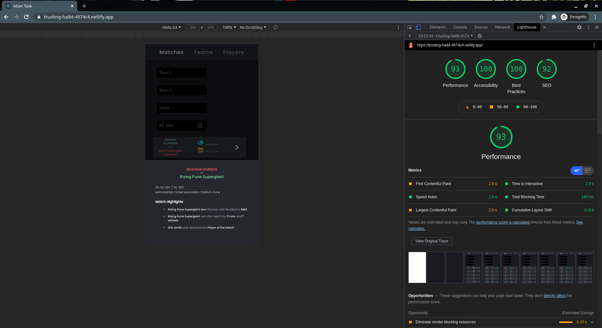
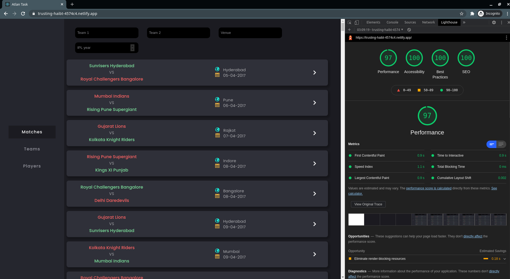
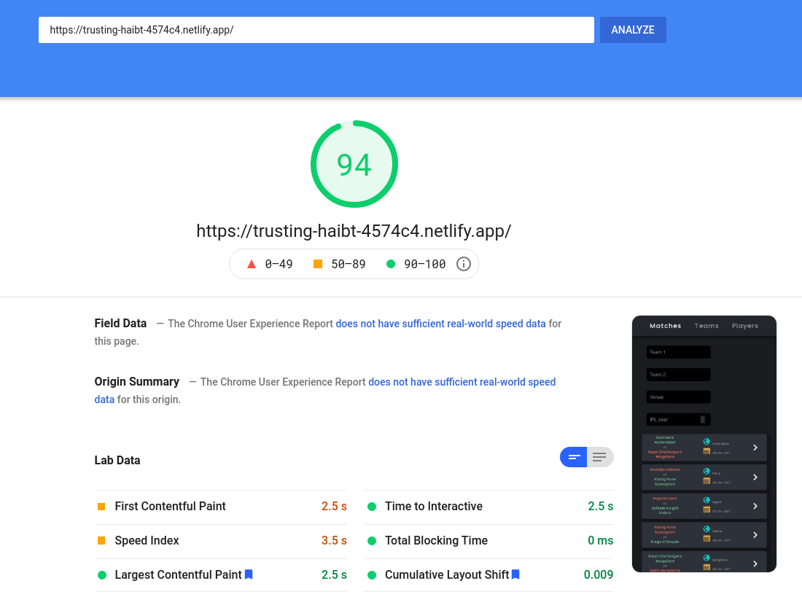

# Performance

---

All the lighthouse reports were generated in a new Incognito Tab so as to avoid caching.

### Lighthouse - Mobile

### Lighthouse - Desktop

### Google PageSpeed Insights

---

# Optimizations

- Used `lazy loading` to render long lists.
- Most of the render blocking was due to the fonts which was substantially reduced by using `link prefetching` and reduing the number of font-weights being requested.
